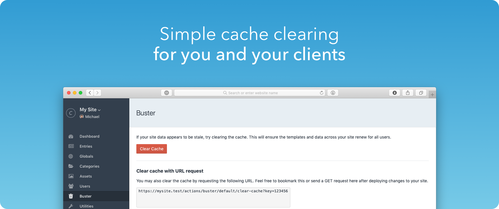

#  Buster

## What is Buster?

Buster gives you a simple area (or URL for a GET request) to clear just the template-based caches on your Craft site. It's a safe area for you and your clients to flush old content without affecting your assets.

## Requirements

This plugin requires Craft CMS 3.0.0-beta.23 or later.

## Installation

To install the plugin, follow these instructions.

1. Open your terminal and go to your Craft project:

        cd /path/to/project

2. Then tell Composer to load the plugin:

        composer require trendyminds/buster

3. In the Control Panel, go to Settings → Plugins and click the “Install” button for Buster.

## Attribution
[Delete](https://thenounproject.com/rose-alice-design/uploads/?i=2025327) by Rose Alice Design from the Noun Project
